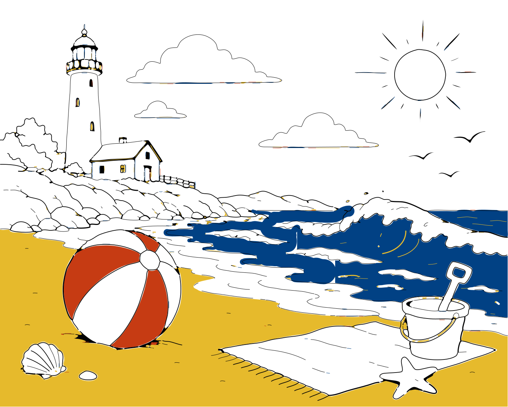

# lineart-trace

**Turn a raster picture of line art into real vector art.**



*Nothing in that loop is a filter or a repaint. The trace came out as paths
grouped by the pen that drew them, so the sand changing colour is one
attribute on one group — six `<animate>` elements for the whole picture. Try
that on the PNG and you are editing pixels.*


Ask ChatGPT — or any image generator — for line art and you get back a *photo*
of a drawing: a grid of pixels that looks like pen work but contains no pen
work. There are no paths in it. You cannot recolour a line, change its weight,
put it on a dark background, dash it, animate it, or print it larger than it
was generated. It is a picture of vector art, not vector art.

This turns it back into the real thing: **1.2 MB of pixels in, 130 KB of SVG
out** — filled regions and stroked centrelines in four inks the tool worked
out for itself, every one of them a curve you can edit.

```bash
pip install git+https://github.com/UCB-BioE-Anderson-Lab/lineart-trace
lineart-trace beach.png --colors 0 --thin-limit 0.05 --close 5 --svg -o beach.svg
```

```python
from lineart_trace import trace_file
r = trace_file("beach.png", colors=0, thin_limit=0.05, close=5)
print(r.n_strokes, r.n_fills, r.colors)
svg = r.to_svg_group(scale=0.5)
```

A second worked example, one closed contour rather than a whole scene:
`polymerase.png` goes in as 777 KB and comes out as
[**3.8 KB**](docs/polymerase.svg) — a single path of 97 cubic Béziers.

## Centrelines, not outlines

The other half of "real vector art" is what shape the paths are. An outline
tracer (potrace, `cv2.findContours`) returns a closed loop *around* every
stroke, so a pen line becomes a long thin sausage: set its width to 8 and you
get a fatter sausage, not a fatter line. **lineart-trace recovers the
centreline**, so a stroke is one open path down the middle of the ink, with a
width you can change. Shapes that are genuinely filled — a solid ball, a band
of sea — are detected and emitted as filled contours instead, because a
centreline cannot represent them.

## What it does

| | |
|---|---|
| **Centrelines** | one open path per stroke, not an outline loop |
| **Per-path stroke width** | recovered from the distance transform, so a drawing with mixed weights stays mixed |
| **Junctions** | every arm of a crossing routes through one shared point, so crossings do not show gaps |
| **Corners** | high-curvature points become segment boundaries, so a square stays square |
| **Filled regions** | shapes too solid to have a centreline are emitted as filled contours, holes included |
| **Colour** | ink is found by distance from the paper *colour*, and can be split into one layer per pen, each path keeping its own colour |
| **Photographs** | uneven lighting is divided out before thresholding, so a phone shot of a crumpled page still works |

## Pipeline

1. **Binarize.** Otsu, after dividing out a blurred estimate of the page when
   the lighting is uneven (`--method`, `--flatten`, `--denoise`). Colour input
   is measured against the paper colour instead of its brightness.
2. **Split fills from strokes.** Regions that are compact rather than
   elongated become contours; everything else goes on to be thinned.
3. **Thin** to a 1-pixel skeleton: Zhang–Suen, then a sequential
   simple-point cleanup.
4. **Build the skeleton graph.** Branch pixels cluster into junctions; the
   runs between them become ordered point chains; spurs are pruned and the
   chains re-spliced.
5. **Fit** each chain with cubic Béziers — Schneider (Graphics Gems, 1990)
   with Newton–Raphson reparameterisation, cut at detected corners.

## Colour

```bash
lineart-trace drawing.png --colors 0 --svg -o drawing.svg   # find the pens
lineart-trace drawing.png --colors 5 --svg -o drawing.svg   # exactly five
```

By default (`--colors 1`) every pen is traced as one colour, as before. Above
1, the ink is split into that many pens and **each path carries the colour it
was drawn in**; `--colors 0` picks the number itself. `TraceResult.colors`
lists what it found.

Two things make this work.

**Ink is found by colour distance from the paper, not by brightness.** Yellow
on white has a luminance around 196 of 255. Convert to grey and it is lighter
than most smudges, so a brightness threshold keeps the smudges and drops the
strokes. Measured in Lab against the paper's own colour, yellow is far away —
and the same measurement still rejects a grey background, because it is a
distance in colour rather than in lightness. This applies even at
`--colors 1`: it is why a yellow stroke is traced at all.

**The ink/paper split cannot be plain Otsu.** Otsu assumes two classes, but
ink in several colours is spread over a wide range of distances — black at
254, yellow at 93 — so Otsu cuts through the middle of the *ink* and calls the
palest pen paper. On a red/blue/yellow/black figure it cut at 98.6 and lost
the yellow. So the threshold is re-examined on whatever was called paper, and
a lower split is accepted when the band it adds looks like a pen. That test is
geometric, not statistical: the antialiased halo of a dark stroke also lives
in that band, and it is recognisable because it *hugs* the ink already found,
while sensor noise is recognisable because it is incoherent. A real pen is
coherent and stands away from the other ink.

Where two pens cross, the upper one covers the lower, so the lower stroke is
genuinely broken in the image and the trace shows the break. `--close 5`
bridges it; the close is applied per layer, because a gap that only exists
after the split cannot be mended before it.

## Four things this gets right that are easy to get wrong

**Thinning must be finished before the topology is read.** Parallel Zhang–Suen
leaves two-pixel-wide diagonal bands, and every pixel inside such a band has
crossing number 2. A hub where eight spokes meet therefore reads as ordinary
line pixels and *no junction is found at all*. The sequential cleanup pass in
`thinning.thin_redundant` removes pixels whose ink neighbours are already
8-connected without them. Note that the textbook simple-point test (crossing
number 1) assumes a 4-connected background and will **not** cut a staircase.

**Branch points come from the crossing number, not the neighbour count.** On a
diagonal staircase an ordinary interior pixel has three 8-neighbours. Counting
neighbours reports false branch points and shatters every curve — a plain
circle traced to 29 separate paths before this was fixed.

**A crossing is a blob, not a pixel.** Thinning an X of 10 px strokes leaves a
cluster of branch pixels. Treating each as its own node emits a fistful of
2-pixel junk chains at every crossing. Branch pixels are clustered and every
arm is routed through the cluster centroid.

**Fill detection cannot depend on the stroke width.** The obvious test is "is
this much wider than a stroke?" — but the stroke width is measured from the
skeleton, and when the picture is mostly fill, the fill sets that width and
the test can never fire. An image of nothing but a solid triangle scored 0.51
under that rule. Thinness, `4πA/P²`, is scale-free: 1.0 for a disc, 0.14 for a
heavy rule, and it needs no reference width. It took the same specimen to
0.99.

## Measured behaviour

Quality is a **round trip**: vectorise, render the vectors back to a raster at
the source resolution, and compare with the ink that should have been there.
`lineart_trace.corpus` holds 40 labelled specimens, each isolating one thing
that can go wrong. Drop your own drawings into `tests/fixtures/` and the
benchmark and test suite pick them up automatically, scored against their own
ink.


```bash
python examples/benchmark.py --no-fixtures --md docs/benchmark.md
python examples/benchmark.py --gallery docs/gallery.html     # visual report
lineart-trace drawing.png --check                            # one file
```

A second worked example, [docs/polymerase.svg](docs/polymerase.svg), is the
opposite extreme: a ChatGPT drawing that is one closed contour with about
sixty scallops, which comes out as **a single path of 97 curves, 3.8 KB from
777 KB** — two hundred times smaller.

Across the 40 corpus specimens: **mean IoU 0.915, median coverage 0.995,
median spill 0.001.** Full table in [docs/benchmark.md](docs/benchmark.md).

| category | IoU | what it covers |
|---|---:|---|
| primitives (line, circle, ellipse) | 0.90 – 0.99 | closed loops, staircase quantisation |
| corners (rectangle, star, zigzag) | 0.87 – 0.99 | sharp turns kept sharp |
| junctions (cross, T, 8-spoke hub, tangency) | 0.90 – 0.99 | no gaps at crossings |
| fills (solid shape, arrowhead, ring with hole) | 0.94 – 0.99 | contours, not spines |
| patterns (hatching, parallels, lettering) | 0.78 – 1.00 | many short strokes |
| drawings (flower, house, face) | 0.88 – 0.95 | ordinary line art |
| colour (five pens, pale ink, crossing pens, tinted paper) | 0.90 – 0.99 | per-pen layers |
| photo / scan | 0.85 – 0.91 | crumpled page, skew, lamp falloff |
| noise (specks, dropouts, faint ink) | 0.83 – 0.95 | damaged input |
| shading (grey wash, tonal ramp, stipple) | 0.65 – 0.88 | see limitations |

### Reading these numbers

**IoU punishes thin strokes and says little about them.** A half-pixel
centreline offset costs a fixed *absolute* amount of overlap, which is a large
*fraction* of a 3-pixel stroke and a small one of a 20-pixel stroke. The same
drawing, redrawn at different weights and traced with identical settings:

| stroke weight | 2 px | 3 px | 5 px | 8 px | 12 px | 20 px |
|---|---:|---:|---:|---:|---:|---:|
| IoU | 0.819 | 0.883 | 0.908 | 0.936 | 0.931 | 0.951 |
| coverage | 1.000 | 0.995 | 0.999 | 0.997 | 0.990 | 0.984 |

The geometry is identical in every column. So judge fine line art by
**coverage** (how much of the ink was reproduced) and **spill** (how much
paint landed on blank paper), and treat IoU as a sub-pixel registration score.
`d95` — how far the worst-placed 5 % of the ink is from anything drawn —
catches a whole stroke going missing, which an area measure can hide.

## Limitations

Each of these is a specimen in the corpus with its measured floor recorded in
`tests/test_corpus.py`, not an untested caveat.

| case | behaviour |
|---|---|
| **Stipple / halftone shading** | IoU 0.65. Dots have no centreline. They come out as small filled regions, and touching dots merge into one — so the count is well under the number drawn. Correct output, poor score. `--min-fill-area` trades resolution against picking up noise. |
| **Grey washes and tonal ramps** | A wash is tone, not line. It either binarises away or becomes one filled region. There is no line to recover, and none is invented. |
| **Lettering** | IoU 0.78. Small counters (the hole in an `e`) and thin serifs fall below the resolution the skeleton can carry. |
| **Tiny isolated dots** | Kept as filled regions above `--min-fill-area` (16 px by default), dropped below it. |
| **Very acute crossings** (< ~15°) | The two branch points sit far apart along the line, so the crossing resolves as two junctions with a short piece between them rather than one. |
| **Antialias dropouts** | A shallow curve can break into pieces at the threshold. `--close 5` bridges them, at the cost of slightly fattening the stroke. |
| **Stroke ends** | Thinning stops about a stroke radius short of a butt end. With the default round line caps this cancels out; with butt caps the line reads short. |
| **Colour under uneven lighting** | The paper colour is estimated globally, so a colour photograph with a strong lighting gradient is not handled: `--flatten` works on brightness and does not apply to the colour path. Scans and renders are fine. |
| **Pens of similar colour** | Two pens within about ΔE 20 are treated as one. Force the split with `--colors N`. |
| **Flat regions with a ragged edge** | Whether a region is filled or stroked is judged by thinness, `4πA/P²`, which a complicated boundary defeats: a beach's sand — wiggly coastline, holes punched by the objects on it — scores 0.033 and traces as centrelines. Lower `--thin-limit` (0.05 on that drawing) at the cost of calling more things fills. |
| **Line work drawn over a colour region** | Splitting by colour puts the outlines in their own layer, which cuts the region beneath them into disconnected slivers: the sand along a shoreline is severed from the sand behind it. The fill detector then finds only the big piece and reconstructs its edge morphologically, giving a smooth blob where the coastline should be. `--close 5` bridges the gaps first. Too large a value bleeds colour past the outline. |

## Command line

```
lineart-trace SRC [-o OUT]

input     --method {auto,fixed,otsu,adaptive}  --thresh N  --flatten/--no-flatten
          --invert  --denoise  --despeckle AREA  --close R
          --colors N  --max-colors N
tracing   --error PX  --prune PX  --corner-angle DEG  --smooth N
          --fill-ratio N  --thin-limit T  --min-fill-area N
output    --width W  --stroke W  --uniform-width  --color C  --background C
          --places N  --svg  --check
```

`--svg` emits a standalone document; without it you get the bare `<g>`, which
is what you want when inlining into a page.

## API

```python
trace_file(path, **kw) -> TraceResult
trace_image(array, **kw) -> TraceResult      # grayscale, BGR or BGRA
trace_mask(mask, **kw) -> TraceResult        # a 0/1 ink mask you made yourself

TraceResult.strokes   -> [StrokePath(curves, width, closed, color), ...]
TraceResult.fills     -> [FillPath(loops, color), ...]  # outer loop, then holes
TraceResult.colors    -> ["#dc0000", ...]               # pens found
TraceResult.to_svg(scale, color, background) -> str
TraceResult.to_svg_group(...) -> str
```

The stages are separately usable: `binarize`, `ink_mask`, `separate_colors`,
`skeletonize`, `build_graph`, `split_fills`, `fit_curve`, `rasterize`,
`compare`.

## Development

```bash
pip install -e ".[dev]"
pytest                                     # 199 tests
python examples/benchmark.py --gallery docs/gallery.html \
           --artifact docs/atlas.html --md docs/benchmark.md
python examples/make_corpus.py out/        # write the corpus as PNGs
```

## License

MIT
